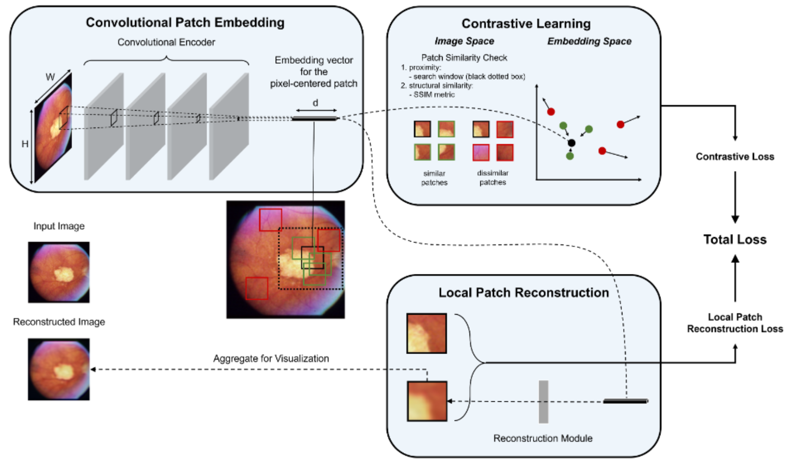
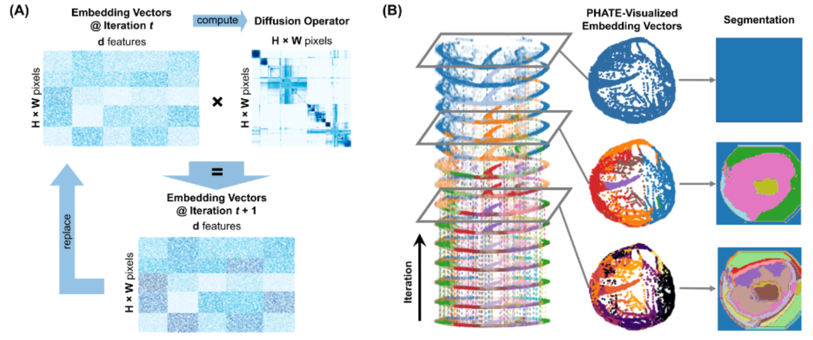

# CUTS: A Fully Unsupervised Framework for Medical Image Segmentation
### Krishnaswamy Lab, Yale University
[](https://twitter.com/KrishnaswamyLab)
[](https://github.com/ChenLiu-1996/UnsupervisedMedicalSeg/)






**This repository contains the official PyTorch implementation of the following paper:**

> **CUTS: A Fully Unsupervised Framework for Medical Image Segmentation**<br>
> Chen Liu, Matthew Amodio, Liangbo L. Shen, Feng Gao, Arman Avesta, Sanjay Aneja, Jay Wang, Lucian V. Del Priore, Smita Krishnaswamy <br>
>
>
> *Chen and Matthew are co-first authors, while Sanjay, Jay, Lucian and Smita are co-advisory authors.*
>
> Please direct correspondence to: smita.krishnaswamy@yale.edu or lucian.delpriore@yale.edu.
>
> https://arxiv.org/abs/2209.11359


## Repository Hierarchy
```
UnsupervisedMedicalSeg (CUTS)
    ├── checkpoints: model weights are saved here.
    ├── config: configuration yaml files.
    ├── data: folders containing data used.
    ├── logs: training log files.
    ├── results: generated results (images, labels, segmentations, figures, etc.).
    └── src
        ├── data_utils
        ├── datasets: defines how to access and process the data in `CUTS/data/`.
        ├── model
        ├── scripts_analysis: scripts for analysis and plotting.
        |   ├── `generate_baselines.py`
        |   ├── `generate_diffusion.py`
        |   ├── `generate_kmeans.py`
        |   ├── `helper_generate_kmeans.py`
        |   ├── `helper_run_phate.py`
        |   ├── `plot_paper_figure_medical.py`
        |   ├── `plot_paper_figure_natural.py`
        |   └── `run_metrics.py`
        ├── utils
        ├── `main_supervised.py`: supervised training of UNet/nnUNet for comparison.
        └── `main.py`: unsupervised training of the CUTS encoder.
```

## Data Provided
The `berkeley_natural_images` and `retina` datasets are provided in `zip` format. The `brain_ventricles` dataset exceeds the GitHub size limits, and can be made available upon reasonable request.

## Dependencies
We developed the codebase in a miniconda environment.
Tested on Python 3.9.13 + PyTorch 1.12.1.
How we created the conda environment:
```
conda create --name cuts pytorch==1.12.1 torchvision==0.13.1 torchaudio==0.12.1 cudatoolkit=11.3 -c pytorch
conda activate cuts
conda install scikit-image pillow matplotlib seaborn tqdm -c anaconda
python -m pip install -U phate
python -m pip install git+https://github.com/KrishnaswamyLab/CATCH
python -m pip install opencv-python
python -m pip install sewar
python -m pip install monai
python -m pip install nibabel
```
Installation usually takes between 20 minutes and 1 hour on a normal desktop computer.

## To reproduce the results in the paper.
The following commands are using `retina_seed2022` as an example (retina dataset, random seed set to 2022).

<details>
  <summary>Unzip data</summary>

```
cd ./data/
unzip retina.zip
```
</details>

<details>
  <summary>Activate environment</summary>

```
conda activate cuts
```
</details>

<details>
  <summary><b>Stage 1.</b> Training the convolutional encoder</summary>

#### To train a model.
```
## Under `src`
python main.py --mode train --config ../config/retina_seed2022.yaml
```
#### To test a model (automatically done during `train` mode).
```
## Under `src`
python main.py --mode test --config ../config/retina_seed2022.yaml
```
</details>

<details>
  <summary>(Optional) [Comparison] Training a supervised model</summary>

```
## Under `src/`
python main_supervised.py --mode train --config ../retina_seed2022.yaml
```
</details>


<details>
  <summary><b>Stage 2.</b> Results Generation</summary>

#### To generate and save the segmentation using spectral k-means.
```
## Under `src/scripts_analysis`
python generate_kmeans.py --config ../../config/retina_seed2022.yaml
```
#### To generate and save the segmentation using diffusion condensation.
```
## Under `src/scripts_analysis`
python generate_diffusion.py --config ../../config/retina_seed2022.yaml
```
#### To generate and save the segmentation using baseline methods.
```
## Under `src/scripts_analysis`
python generate_baselines.py --config ../../config/retina_seed2022.yaml
```
</details>

<details>
  <summary>Results Plotting</summary>

#### To reproduce the figures in the paper.
There are primarily two scripts for this purpose: `plot_paper_figure_natural.py` and `plot_paper_figure_medical.py`. The difference between them is self-explanatory by their names.

The `image-idx` argument shall be followed by space-separated index/indices of the images to be plotted.

Without the `--comparison` flag, the CUTS-only results will be plotted.
With the ` --comparison` flag, the side-by-side comparison against other methods will be plotted.

With the ` --grayscale` flag, the input images and reconstructed images will be plotted in grayscale.

```
## Under `src/scripts_analysis`

## For natural images (berkeley)
python plot_paper_figure_natural.py --config ../../config/$CONFIG_FILE.yaml --image-idx $IMAGE_IDX
python plot_paper_figure_natural.py --config ../../config/$CONFIG_FILE.yaml --image-idx $IMAGE_IDX --comparison

## For medical images with color (retina)
python plot_paper_figure_medical.py --config ../../config/$CONFIG_FILE.yaml --image-idx $IMAGE_IDX
python plot_paper_figure_medical.py --config ../../config/$CONFIG_FILE.yaml --image-idx $IMAGE_IDX --comparison

## For medical images without color (brain)
python plot_paper_figure_medical.py --config ../../config/$CONFIG_FILE.yaml --image-idx $IMAGE_IDX --grayscale
python plot_paper_figure_medical.py --config ../../config/$CONFIG_FILE.yaml --image-idx $IMAGE_IDX --comparison --grayscale
```
</details>

<details>
  <summary>Results Analysis</summary>

#### To compute the quantitative metrics.
Assuming segmentation results have already been generated and saved.
```
## Under $CUTS_ROOT/src/scripts_analysis
python run_metrics.py --config ../../config/$CONFIG_FILE.yaml
```
</details>

## To train on your custom dataset **with label**.
**NOTE**: Since our method is **completely unsupervised**, the only additional benefit for providing labels are:
1. With labels, we will have meaningful quantitative metrics (dice coefficient, etc.) when you run `run_metrics.py`.
2. With labels, for binary segmentation tasks, our method can predict binary masks in addition to multi-scale segmentations.

The process is largely the same as detailed in the section: **To reproduce the results in the paper** above.

<details>
  <summary>The additional work you need to complete prior to training are</summary>

1. Put your dataset under `src/data/`, similar to the other datasets.
2. Write your custom config file and put it under `config/`, similar to the other config files.
3. Write your custom `Dataset` class in `src/datasets/***.py`, similar to the existing examples.
    - If your dataset is very small (e.g., 50 images), you can refer to `src/datasets/brain_ventricles.py` or `src/datasets/retina.py`, where the data is pre-loaded to the CPU prior to training.
    - If your dataset is rather big, you can refer to `src/datasets/brain_tumor.py`, where the data is loaded on-the-fly during training.
4. Make sure your custom `Dataset` is included in `src/data_utils/prepare_datasets.py`, both in the import section on the top of the page, and inside the `prepare_dataset` function, alongside the lines such as `dataset = Retina(base_path=config.dataset_path)`.
</details>

Other than that, you can use the pipeline as usual.

## To train on your custom dataset **without label**.

The process is largely the same as detailed in the section: **To reproduce the results in the paper** above.

<details>
  <summary>The additional work you need to complete prior to training are</summary>

1. Put your dataset under `src/data/`, similar to the other datasets.
2. Write your custom config file and put it under `config/`, similar to the other config files. Please note that, just like `example_dataset_without_label_seed2021.yaml`, you shall specify the additional field `no_label: True`.
3. Write your custom `Dataset` class in `src/datasets/***.py`, similar to the existing examples.
    - If your dataset is very small (e.g., 50 images), you can refer to `src/datasets/brain_ventricles.py` or `src/datasets/retina.py`, where the data is pre-loaded to the CPU prior to training.
    - If your dataset is rather big, you can refer to `src/datasets/brain_tumor.py`, where the data is loaded on-the-fly during training.
    - However, you need to pay attention that, since your custom dataset does not have labels, you shall refer to `src/datasets/example_dataset_without_label.py` to see how you need to use an `np.nan` as a placeholder for the non-existent labels inside the `__getitem__` method.
4. Make sure your custom `Dataset` is included in `src/data_utils/prepare_datasets.py`, both in the import section on the top of the page, and inside the `prepare_dataset` function, alongside the lines such as `dataset = ExampleDatasetWithoutLabel(base_path=config.dataset_path)`.
</details>

Other than that, you can use the pipeline as usual.

Be mindful though: when you run `generate_kmeans.py`, the script will still print out dice scores for each image. The values shall be very close to zero (on the order of 1e-16). This does not mean the segmentation is bad. This only means the ground truth label is not provided. The dice score is computed against a placeholding all-zero label, with a very tiny numerical stability term.

**SPECIAL NOTE**: The outcome of this pipeline will be the multi-scale segmentations as a result of diffusion condensation. No binary mask will be generated. **If you really want the model to generate binary masks in addition to the multi-scale segmentations, what you can do is to provide a set of pseudo-labels** as follows:
1. Instead of segmenting the desired region-of-interest carefully as in regular labels, you just casually circle/square/whatever a typical enough subregion inside region-of-interest, and mark them as 1's whereas the backgrounds as 0's.
2. Then, you provide these casual pseudo-labels as if they were real labels. Put them in the correct folders under `src/data/` and load them as if they were real labels in your `src/datasets/***.py`.
3. Follow the pipeline as in the previous section: **To train on your custom dataset with label**.
4. In this way, binary masks will also be generated. Please be careful though: the quantitative metrics will not be accurate, as you are providing pseudo-labels instead of accurate real labels.

## DEBUG Notes
<details>
  <summary>Regarding "dead lock" (e.g., never-ending repeated `Time out!`) when generating results.</summary>

On our YCRC server, sometimes we need to run
```
export MKL_THREADING_LAYER=GNU
```
before running some of the code code to minimize the risk of dead lock. For details, see https://github.com/joblib/threadpoolctl/blob/master/multiple_openmp.md.

**UPDATE Dec 26, 2022**: I finally wrote a workaround to avoid running the script over and over again from the first incomplete file whenever a deadlock is hit (which is a total waste of human efforts)! The method is simple: in `generate_kmeans.py` we now outsource the kmeans computation and numpy saving to a helper file `helper_generate_kmeans.py`, and we kill and restart the helper whenever a deadlock causes the process to timeout. **However**, on our YCRC server, you may **still** need to run the command `export MKL_THREADING_LAYER=GNU` to minimize risk of dead lock.

</details>

<details>
  <summary>Regarding `zsh bus error`.</summary>

If you encounter `zsh bus error` while running some of the python scripts, for example, `generate_kmeans.py` or `generate_diffusion.py`, it is very likely that the program requires more CPU than available. On our YCRC, the solution is to request more memory for the job.
</details>
